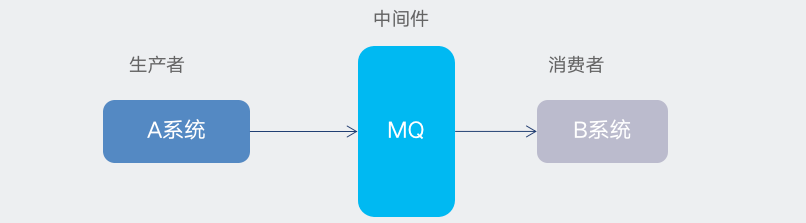
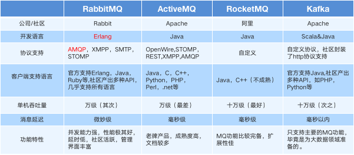
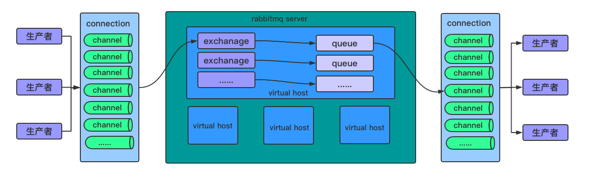
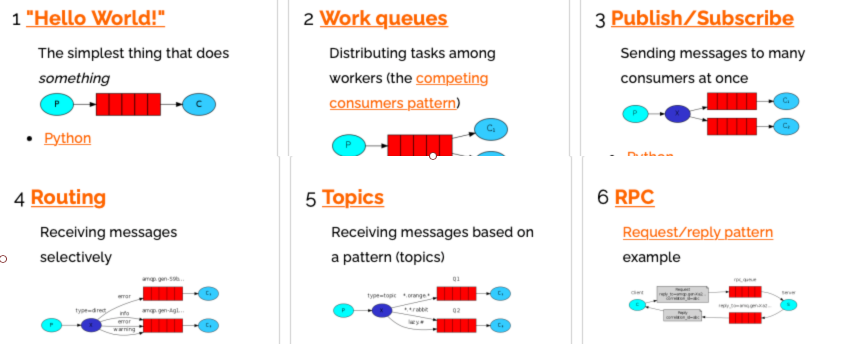
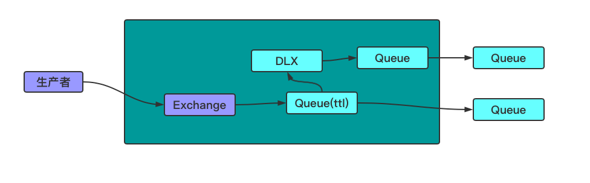
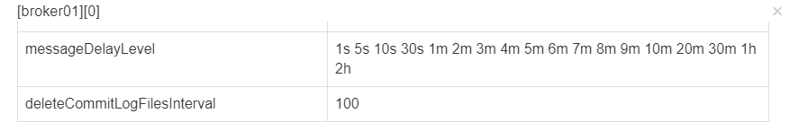
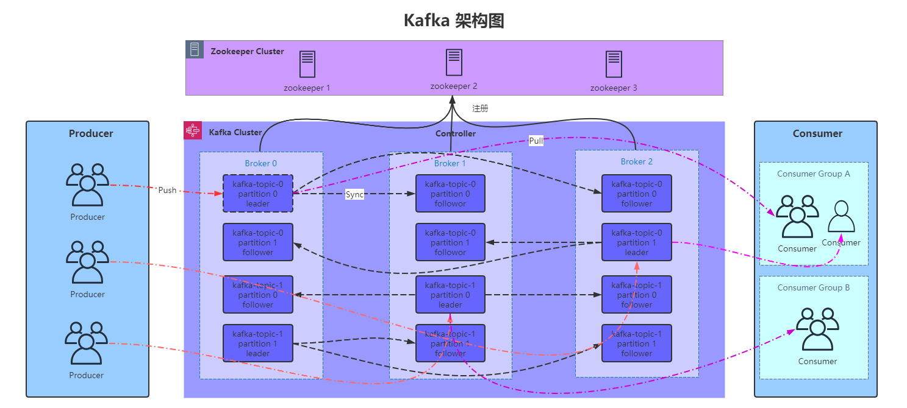
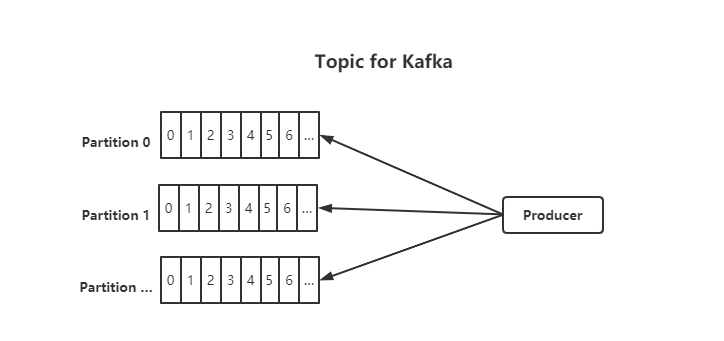

# MQ集成

- [更新日志](#更新日志)
- [《MQ集成》使用说明](#MQ集成)
    - [项目背景](#项目背景)
    - [集成环境说明](#集成环境说明)
    - [工程结构](#工程结构)
    - [RabbitMQ使用](#RabbitMQ使用)
        - [rabbitmq工作模式](##rabbitmq工作模式)
            - [rabbitmq架构图](###rabbitmq架构图)
            - [rabbitmq工作模式介绍](###rabbitmq工作模式介绍)
        - [rabbitmq确认机制](##rabbitmq确认机制)
        - [ttl+dlx实现延迟队列](##ttl+dlx实现延迟队列)
    - [RocketMQ使用](#RocketMQ使用)
        - [发展历程](##发展历程)
        - [rocketmq整体架构](##rocketmq整体架构)
            - [rocketmq特性](###rocketmq特性)
            - [rocketmq专业术语](###rocketmq专业术语)
        - [rocketmq工作模式](##rocketmq工作模式)
            - [基本消息](###基本消息)
            - [广播消息](###广播消息)
            - [顺序消息](###顺序消息)
            - [延迟消息](###延迟消息)
            - [批量消息](###批量消息)
            - [消息过滤](###消息过滤)
            - [acl权限控制](###acl权限控制)
    - [Kafka使用](#Kafka使用)
        - [简介](##简介)
        - [kafka基本概念](##kafka基本概念)
            - [kafka特性](###kafka特性)
            - [kafka专业术语](###kafka专业术语)
            - [kafka消费模型](###kafka消费模型)
            - [Topic和log](###Topic和log)
        - [Kafka高级特性](##Kafka高级特性)
            - [日志分段存储😂](###日志分段存储😂)
            - [Kafka Controller](###Kafka Controller)
            - [Leader选举机制](###Leader选举机制)
            - [Rebalance机制](###Rebalance机制)

# 更新日志

| 版本 | 更新说明 | 日期 | 更新人 |
| -------- | ---------|-------|------------ |
| v1.0.0 | 编写rabbitmq单机环境搭建文档 | 2020/12/8 | 张子尧 |
| v1.0.1 | spring&springboot整合rabbitmq | 2020/12/20 | 张子尧 |
| v1.0.2 | rabbitmq说明文档编写 | 2020/12/27 | 张子尧 |
| v1.0.3 | rabbitmq集群环境搭建文档编写 | 2020/12/28 | 张子尧 |
| v1.1.0 | rocketmq单机环境搭建文档编写 | 2020/12/29 | 张子尧 |
| v1.1.1 | rocketmq原生API案例 | 2020/12/30 | 张子尧 |
| v1.1.2 | rocketmq集群环境搭建文档 | 2020/12/31 | 张子尧 |
| v1.1.3 | 编写rocketmq使用文档 | 2020/12/31 | 张子尧 |
| v1.2.1 | 编写Kafka环境搭建文档 | 2021/1/2 | 张子尧 |
| v1.2.2 | 编写Kafka说明文档 | 2021/1/4 | 张子尧 |

# 项目背景

# 集成环境说明

|  | 版本 | 支持环境| 安装文档 | 相关信息 |
| -------- | ---------|----|------------ | ------------: |
| rabbitmq | **3.8.5** | single/cluster | [rabbitmq环境搭建文档](doc/rabbitmq搭建文档.md) |  &nbsp;&nbsp; [**安装包**](resources/install/rabbitmq)<br>[**配置文件**](resources/conf/rabbitmq)|
| rocketmq | **4.7.1** |single/cluster | [rocketmq环境搭建文档](doc/rocketmq搭建文档.md) |  &nbsp;&nbsp; [**安装包**](resources/install/rocketmq)<br>[**配置文件**](resources/conf/rocketmq) |
| kafka | **4.4.1** | single/cluster | [kafka环境搭建文档](doc/kafka搭建文档.md) |  &nbsp;&nbsp; [**安装包**](resources/install/kafka)<br>[**配置文件**](resources/conf/kafka) |

# 工程结构

① Common-mq工程清单

| 工程名 | 描述 |
| --- | --- |
|  common-mq | 父模块 |
| &nbsp;&nbsp; doc | 文档 |
| &nbsp;&nbsp; resources | 安装包&配置文件 |
| &nbsp;&nbsp; common-mq-model | 基础类 |
| &nbsp;&nbsp; common-mq-basics | MQ原生API |
| &nbsp;&nbsp; common-mq-spring | spring整合MQ |
| &nbsp;&nbsp; common-mq-springboot | springboot整合MQ |
| &nbsp;&nbsp; common-mq-utils | mq整合 |

# RabbitMQ使用

&nbsp;&nbsp;MQ全称 Message Queue（消息队列），是在消息的传输过程中保存消息的容器。多用于分布式系统之间进行通信。<br>


##

**MQ优势**

- 应用解耦：提高系统容错性和可维护性
- 异步提速：提升用户体验和系统吞吐量
- 削峰填谷：提高系统稳定性
  <br>

**MQ劣势**

- 系统可用性降低：系统引入的外部依赖越多，系统稳定性越差。一旦 MQ 宕机，就会对业务造成影响。
- 系统复杂度提高： MQ的加入大大增加了系统的复杂度，以前系统间是同步的远程调用，现在是通过 MQ 进行异步调用。

##

**常见mq产品介绍图**
<br>  <br>


## rabbitmq工作模式

### rabbitmq架构图



- virtual host：虚拟机，rabbitmq会把内部空间隔离出一个个的vhost，virtual host之间是完全隔离的，方便不同环境建立virtual host做数据隔离。
- connection：客户端和rabbitmq server之间的TCP连接。
-

channel：channel是在connection内部建立的逻辑连接通道，amqp包含了channelId帮助客户端识别channel，所以在每一个channel之间是完全隔离的。channel作为轻量级的connection，极大的减少了操作系统建立 TCP连接的开销

- exchange：生产者发送消息之后会首先到达exchange，然后根据规则匹配具体的routing key把消息分发达queue中，通常exchange包括fanout、direct、和topic三种模式。
    - fanout：广播
    - direct：定向
    - topic：通配符
- queue：exchange通过routing key最终会送达到queue中。
- binding：exchange和queue之间的虚拟连接，通常使用routing key 进行匹配绑定。消息通过不同的routing key路由到不同的队列当中；是消息分发的依据。

### rabbitmq工作模式介绍

[rabbitmq官方说明提供了六种工作模式](https://www.rabbitmq.com/getstarted.html) : 简单模式、work queue、publish/subscribe、routing、topic、rpc。
<br>

+ 简单模式：生产者个消费者通过一个队列传输消息，消息会走默认的exchange
+ work queue：和简单模式一样，但消费者可以是多个。
+ publish/subscribe：发布订阅模式，生产者把消息发送到exchange，exchange在把消息路由到绑定该交换机的对列中，监听该队列的所有消费者都会接受到消息。
+ routing：消息在exchange上通过不同的routing key把消息分发到不同的队列。注意routing必须完全匹配才会路由到正确的队列中。
+ topic：该找匹配规格匹配routing key，*可以匹配一个单词，#可以匹配多个。
+ rpc：

## rabbitmq确认机制

- confirm:生产者把消息发送到broker上时产生的状态，ack代表消息已经到达broker，nack则代表消息没有到达broker。
- return:代表broker正常confirm ack后，但消息没有进入具体的queue中则会产生的回调。
  <br>
  具体实现代码入下：
  [RabbitConfig.java](common-mq-spring/src/main/java/com/kiss/spring/rabbit/conf/RabbitConfig.java)

```java
public class Producer {
    /**
     * rabbitmq 确认机制 confirm&return
     * 开启confirm模式
     * connectionFactory.setPublisherConfirms(true);
     * 开启return模式
     * connectionFactory.setPublisherReturns(true);
     * @param rabbitTemplate {@link org.springframework.amqp.rabbit.core.RabbitTemplate}
     */
    public void confirm(RabbitTemplate rabbitTemplate) {
        rabbitTemplate.setConfirmCallback((confirm, ack, res) -> {
            log.info("confirm 方法被执行！！！");
            if (ack) {
                log.info("消息已经到达交换机：{}", res);
            } else {
                log.error("消息没有到达交换机：{}，返回信息为：{}", confirm, res);
            }
        });

        rabbitTemplate.setMandatory(true);
        rabbitTemplate.setReturnCallback((message, replyCode, replyText, exchange, routingKey) -> {
            log.info("return 执行了....");
            log.info("message:{}", message);
            log.info("replyCode:{}", replyCode);
            log.info("replyText:{}", replyText);
            log.info("exchange:{}", exchange);
            log.info("routingKey:{}", routingKey);
        });
        rabbitTemplate.convertAndSend(QueueConstants.AMQ_TOPIC, "email.qq.gaming", "hello queue!!!");

        try {
            Thread.sleep(5000);
        } catch (InterruptedException e) {
            e.printStackTrace();
        }
    }
}
```

## ttl+dlx实现延迟队列

- ttl特性：设置消息过期时间，如果消息到了规定的时间内还没有被消费，则会被丢弃。
- dlx特性：消息在特定的时间内没有被消费则会被路由到新的exchange中，然后在路由的新的queue中。
- 延迟队列实现原理：通过ttl和dlx的特性可以设置两个对列，创建监听器监听死信队列，实现延迟队列。

**实现架构图**


<br>

**具体实现配置**

xml配置：

```xml
<!--==========================死信+ttl===========================================-->
<!--exchange-->
<rabbit:topic-exchange name="exchange_dlx" id="exchange_dlx" auto-declare="true">
    <rabbit:bindings>
        <rabbit:binding pattern="dlx.#" queue="queue_dlx"/>
    </rabbit:bindings>
</rabbit:topic-exchange>
        <!--dlx-->
<rabbit:queue id="queue_dlx" name="queue_dlx" auto-declare="true">
<rabbit:queue-arguments>
    <!--设置死信队列交换机-->
    <entry key="x-dead-letter-exchange" value="exchange_dlx_last"/>
    <!--设置死信队列路由key-->
    <entry key="x-dead-letter-routing-key" value="dlx.zhang"/>
    <!--设置队列过期时间 ttl-->
    <entry key="x-message-ttl" value="20000" value-type="java.lang.Integer"/>
    <!--设置队列长度限制-->
    <entry key="x-max-length" value="5" value-type="java.lang.Integer"/>
</rabbit:queue-arguments>
</rabbit:queue>
        <!---->
<rabbit:queue id="queue_dlx_last" name="queue_dlx_last"/>
<rabbit:topic-exchange name="exchange_dlx_last" auto-declare="true">
<rabbit:bindings>
    <rabbit:binding pattern="dlx.#" queue="queue_dlx_last"/>
</rabbit:bindings>
</rabbit:topic-exchange>
        <!--==========================死信+ttl===========================================-->
```

配置文件配置：

```java
/**
 * @author zhangziyao
 * @date 2020/12/26 9:10 下午
 */
@Component
@Slf4j
public class RabbitAdminConfig implements InitializingBean {
    @Autowired
    private RabbitAdmin rabbitAdmin;

    /**
     * 创建队列
     *
     * @param queueName 队列名称
     * @return 返回队列名称
     */
    public String createQueue(String queueName, Map<String, Object> ages) {
        log.info("创建队列：{}", queueName);
        rabbitAdmin.declareQueue(new Queue(queueName, true, false, false, ages));
        return queueName;
    }

    /**
     * 创建交换机
     *
     * @param ExchangeName 交换机名称
     * @param workMode     交换机工作模式 参考 {@link WorkMode}
     * @return 返回交换机名称
     */
    public String createExchange(String ExchangeName, WorkMode workMode) {
        log.info("创建交换机：{}", ExchangeName);
        switch (workMode) {
            case fanout:
                rabbitAdmin.declareExchange(new FanoutExchange(ExchangeName, true, false, null));
                break;
            case direct:
                rabbitAdmin.declareExchange(new DirectExchange(ExchangeName, true, false, null));
                break;
            case topic:
                rabbitAdmin.declareExchange(new TopicExchange(ExchangeName, true, false, null));
                break;
            default:
                log.info("没有要创建的交换机类型：{}", workMode);
        }
        return ExchangeName;
    }

    @Override
    public void afterPropertiesSet() throws Exception {

        Map<String, Object> agrs = new HashMap<>();
        agrs.put(ArgKeys.X_MESSAGE_TTL.getKey(), 10000);
        agrs.put(ArgKeys.X_DEAD_LETTER_EXCHANGE.getKey(), "dlx.exchange.last.admin");
        agrs.put(ArgKeys.X_DEAD_LETTER_ROUTING_KEY.getKey(), "dlx.zhang.admin");
        agrs.put(ArgKeys.X_MAX_LENGTH.getKey(), 5);


        rabbitAdmin.declareBinding(new Binding(createQueue("dlx.queue.admin", agrs)
                , Binding.DestinationType.QUEUE
                , createExchange("dlx.exchange.admin", WorkMode.topic)
                , "dlx.#"
                , null));
        rabbitAdmin.declareBinding(new Binding(createQueue("dlx.queue.last.admin", null)
                , Binding.DestinationType.QUEUE
                , createExchange("dlx.exchange.last.admin", WorkMode.topic)
                , "dlx.#"
                , null));
    }
}
```

# RocketMQ使用

rocketmq是一款纯java、分布式、队列模型的开源消息中间件、是一个低延迟、可扩展、高吞吐量的一款mq产品。支持事务消息、顺序消息、批量消息、定时消息、消息回溯等。

## 发展历程

rocketmq的前身是有kill me维护的Metamorphosis产品的扩展，后续到3.0发布后更名为rocketmq。

## rocketmq整体架构

### rocketmq特性

- 支持发布(publish)/订阅(subscribe)，和点对点（p2p）的消息模型；
- 支持顺序消费，利用了单个队列先进先出（FIFO）的特性实现消息的顺序消费，注意这里支持局部有序，也就是说只支持单个messagequeue中消息有序，无法做到全局有序；
- 支持拉模式（pull）和推模式（push）两种消费模式。
    - pull：消费者主动去broker上拉取消息，可以自己管理偏移量；
    - push：设置消息监听器进行回调来消费消息；
- 单一队列支持百万级别的消息积压能力；
- 支持多种消息协议，比如jms，mqtt等；
- 组概念，通过Group机制，让RocketMQ天然的支持消息负载均衡；
- 消息失败重试机制、高效的订阅者水平扩展能力、强大的API、事务机制等等。


### rocketmq专业术语

- nameserver：Name Server 为 producer 和 consumer 提供路由信息。

- broker：Broker 是 RocketMQ 系统的主要角色，其实就是前面一直说的 MQ。Broker 接收来自生产者的消息，储存以及为消费者拉取消息的请求做好准备。

- producer：消息生产者，生产者的作用就是将消息发送到 MQ，生产者本身既可以产生消息，如读取文本信息等。也可以对外提供接口，由外部应用来调用接口，再由生产者将收到的消息发送到 MQ

- producer group：生产者组，简单来说就是多个发送同一类消息的生产者称之为一个生产者组。在这里可以不用关心，只要知道有这么一个概念即可。

- consumer：消息消费者，简单来说，消费 MQ 上的消息的应用程序就是消费者，至于消息是否进行逻辑处理，还是直接存储到数据库等取决于业务需要。

- consumer group：消费者组，和生产者类似，消费同一类消息的多个 consumer 实例组成一个消费者组。

- topic：Topic 是一种消息的逻辑分类，比如说你有订单类的消息，也有库存类的消息，那么就需要进行分类，一个是订单 Topic 存放订单相关的消息，一个是库存 Topic 存储库存相关的消息，推荐一个系统使用一个topic。

- message：Message 是消息的载体。一个 Message 必须指定 topic，相当于寄信的地址。Message 还有一个可选的 tag 设置，以便消费端可以基于 tag 进行过滤消息。也可以添加额外的键值对，例如你需要一个业务 key 来查找 broker 上的消息，方便在开发过程中诊断问题。

- tag：标签可以被认为是对 Topic 进一步细化。一般在相同业务模块中通过引入标签来标记不同用途的消息。

## rocketmq工作模式

### 基本消息

生产者：

- 单向发送：producer发送消息到broker，不会等待broker返回结果
- 同步发送：producer发送消息到broker，等待broker返回结果后发送完成
- 异步发送：producer发送消息到broker后悔通过回调函数的形式返回发送状态

消费者：

- 推送模式：由broker主动推送消息到consumer
- 拉取模式（系统管理偏移量）：由consumer主动找broker拉取消息，不维护偏移量
- 拉取模式（自己管理偏移量）：由consumer主动找broker拉取消息，自已委会偏移量（可以指定偏移量位置进行消息消费）

### 广播消息

rocketmq广播消息实现还是比较简单的，只需要指定消费者端的消费模型即可

```java
//messageModel有两种类型CLUSTERING集群模式，BROADCASTING广播模式（默认为集群）
consumer.setMessageModel(MessageModel.BROADCASTING);
```

### 顺序消息

rocket实现消息顺序消费的原理是利用了Queue的FIFO特性，把需要保持顺序的消息放到同一个消息队列中来包保证消息的局部有序性

<br>

producer

```java
SendResult sendResult=producer.send(message,(list,message,args)->{
        //相同订单的消息放到同一个队列中 实现消息顺序消费
        Integer id=(Integer)args;
        return list.get(id%list.size());
        },i);
```

consumer

```java
consumer.registerMessageListener((MessageListenerOrderly)(list,consumeOrderlyContext)->{
        consumeOrderlyContext.setAutoCommit(true);
        for(MessageExt messageExt:list){
        log.info("本次消费消息为：{}",new String(messageExt.getBody()));
        }
        return ConsumeOrderlyStatus.SUCCESS;
        });
```

### 延迟消息

rocketmq apache版延迟消息把延迟等级分为18个等级



```java
Message message=new Message("Delay","tag","延迟消息！！！".getBytes());
//messageDelayLevel=1s 5s 10s 30s 1m 2m 3m 4m 5m 6m 7m 8m 9m 10m 20m 30m 1h 2h
        message.setDelayTimeLevel(3);
```

### 批量消息

消息不能是延迟消息、事务消息等。消息大小不能超过4194304字节;

消息分隔参考[MessageCutting](common-mq-basics/src/main/java/com/kiss/proto/rocketmq/batch/MessageCutting.java)

### 消息过滤

消息过滤：上推过滤条件到broker，减少磁盘io等

```java
/**
 * 过滤模式
 * 支持tag过滤
 * 简单sql过滤：支持 OR,IN,AND,BETWEEN,IS NULL,IS NOT IN,>,<,=,<>等
 * 常量支持类型：数值、字符（必须单引号）、null（特殊常量）、布尔值
 * 备注：只有推模式支持sql条件过滤
 */
```

## rocketmq配置解读

|         参数名          |          默认值           | 说明                                                         |
| :---------------------: | :-----------------------: | ------------------------------------------------------------ |
|       namesrvAddr       |           null            | nameserver地址                                               |
|       listenPort        |           10911           | 接受客户端连接的监听端口                                     |
|        brokerIP1        |      默认网卡ip地址       | 当前broker监听地址                                           |
|        brokerIP2        |      默认网卡ip地址       | 从节点broker监听地址                                         |
|       brokerName        |           null            | broker名称                                                   |
|    brokerClusterName    |      DefaultCluster       | 集群名称                                                     |
|        brokerId         |             0             | brokerId，master为0，其他数值都为salve节点                   |
|       brokerRole        |       ASYNC_MASTER        | Broker的角色：SYNC_MASTER(同步双写)/ASYNC_MASTER(异步复制)/SLAVE |
|       deleteWhen        |            04             | 删除文件时间点，默认凌晨4点                                  |
|      flushDiskType      |        ASYNC_FLUSH        | 刷盘方式：ASYNC_FLUSH异步刷盘/SYNC_FLUSH同步刷盘             |
|  storePathConsumeQueue  | $HOME/store/consumequeue/ | 存储 consume queue 的路径                                    |
|   storePathCommitLog    |  $HOME/store/commitlog/   | 存储 commit log 的路径                                       |
| mappedFileSizeCommitLog |    1024 * 1024 * 1024     | commit log 的映射文件大小1G                                  |
|   fifileReservedTime    |            72             | 以小时计算的文件保留时间                                     |

# Kafka使用

## 简介

**Kafka**是最初由Linkedin公司开发，是一个*分布式*、*分区的*、*多副本的*、*多订阅者*，基于**zookeeper**协调的分布式日志系统（也可以当做MQ系统），常见可以用于web/nginx日志、访问日志，消息服务，大数据场景等等，Linkedin于2010年贡献给了Apache基金会并成为顶级开源项目。

kafka设计目标：

- 以时间复杂度为O(1)的方式提供消息持久化能力，即使对TB级以上数据也能保证常数时间的访问性能
- 高吞吐率。即使在非常廉价的商用机器上也能做到单机支持每秒100K条消息的传输
- 支持kafka server间的消息分区，及分布式消费，保证每个partition内的消息顺序传输
- 同时支持离线数据处理和实时数据处理
- 支持线上水平扩展

kafka常见的使用场景：

- 日志收集：kafka适应收集各服务的日志，常见的有hadoop、hbase等
- 消息系统：消息系统解耦、缓存消息等
- 用户轨迹跟踪：记录用户活动轨迹。比如说浏览、搜索，点击等，通过记录用户的活动轨迹做用户行为分析等

## kafka基本概念

### kafka特性

kafka包含传统消息中间件的特性，具有单播/多播两种常见的消费模型。kafka高度依赖文件系统来做存储和消息缓存，所以说kafka消息是会*持久化*到磁盘上的，这点和其他中间件有些不同，kafka不会在consumer消费完消息后丢弃消息，而是用offset来管理要消费的消息。对于kafka来说*高吞吐量*是它的主要优势，kafka将数据写到磁盘，充分利用了磁盘的顺序读写。同时在数据写入和数据同步时采用了零拷贝技术采用了sendFile()函数调用，完全是在内核中操作，从而避免了内核缓冲区与用户缓冲区之间数据的拷贝，操作效率极高。还有它的***可扩展性***、***多客户端支持***、***安全机制***、***数据备份***、***轻量***、***消息积压***等。

#### kafka整体架构


### kafka专业术语

| 名称               | 说明                                                         |
| ------------------ | ------------------------------------------------------------ |
| **Broker**         | 中间件服务节点，一个kafka节点就相当于一个broker              |
| **Topic**          | topic是kafka对于消息的一种逻辑归类，每一条消息都要指定一个topic |
| **Partition**      | topic是kafka的一个逻辑概念，而partition则是kafka的一种物理分区概念，一个topic最少包含一个partition，而且在partition中消息时有序的 |
| **Producer**       | 消息生产者，向broker发送消息的客户端                         |
| **Consumer Group** | 消费组，每个消费者都属于一个消费组                           |
| **Consumer**       | 消费者，从broker读取消息的客户端                             |

### kafka消费模型

kafka和其他消息中间件有相同的消息消费模型，具有单播（点对点）/多播（发布订阅）模式

- 单播消费：kafka中一条消息只能被同一个消费组下的一个消费者消费，所以单播模式只需要把消费者放到共一个消费组下即可实现单播
- 多播消费：针对kafka同一条消息只能被同一个消费组下的一个消费者的特性，至于要保证消费者不在一个消费组中即可实现多播的消费模型

### Topic和log

在kafka中**Topic**是一个消息的必备属性，每一条消息都会通过**Topic**指定发送，Topic在kafka中可以理解为一类消息的别称，在Topic下有一个或多个**Partition**的物理分区，在一个partition中消息是可以保证**顺序**的。

<br>



在kafka中partition是一个有序的消息队列，producer会把消息发送到partition中，消息会按照顺序添加到对应partition的**commit log**文件中，消息在partition中都会有一个唯一的办好**offset**，是用来标识partition中的message。

在Topic下每一个**partition**都对应一个**commit log**文件，而在同一个**partition**中**offset**是唯一的message标识。

kafka一般不会删除消息，不管消息有没有被消费掉，只会根据配置的保留时间来确认消息多久后会被删除，kafka默认消息保存一周后会被删除，而且kafka的性能和消息的数据量大小没有关系，因此保留大量的数据 消息对系统性能不会有什么影响。

在consumer中，**consumer**是基于自己在commit log中的**offset**来进行消息消费的，而且offset是由消费者自己来维护的，消费者可以自己指定从什么位置开始消费消息，所以这意味消费者对于集群的性能影响是非常小的。

总的来说，**Topic**是一个逻辑上的语文数据集，比如相同的业务数据可以使用一个topic，用户相关的操作日志可以用同一个topic等。而partition则是对数据做一个物理分区，比如某一日志数据量很大的时候我们可以利用分区的原理把数据分别存放在不用的机器上。**Broker**可以看做kafka的一个进程，一个kafka节点就相当于一个broker。

## Kafka高级特性

### 日志分段存储😂

在kafka中一个分区的消息数据对应存储在一个文件夹下，命名方式以topic名称+分区号命名。而消息在分区内也是分段存储的，有利的是方便旧的消息可以很快删除。kafka规定一个分段文件大小为1g，目的是为了方便发log文件加载到内存中去操作。

```sh
#文件命名是以log文件中第一个offset命名的比如offset为0，则命名为00000000000000000000.log
#kafka每次往分区发4k消息就会记录一条当前消息的offset到index文件中，快速定位消息会先到
#index文件中快速定位，然后再到log文件中去找具体的消息
-rw-r--r-- 1 root root 10485760 1月   5 14:59 00000000000000000000.index #索引存储文件 
#消息存储日志文件，主要存储offset和消息体
-rw-r--r-- 1 root root 13667641 1月   5 14:59 00000000000000000000.log #消息日志存储文件
#和index文件一样，每发送4k就会记录一条当前消息的时间戳和offset
-rw-r--r-- 1 root root 10485756 1月   5 14:59 00000000000000000000.timeindex #消息时间存储文件
-rw-r--r-- 1 root root        8 1月   5 10:11 leader-epoch-checkpoint
```

### Kafka Controller

#### Controller概述

在kafka集群中，每一个kafka节点都是一个broker，而其中一个broker会被选举为**Kafka Controller**（总控制器），Controller负责管理整个集群中所有的分区和副本状态。

- 当某个分区的leader出现故障时，由Controller负责选举出新的leader副本。
- 当检测出某个分区的isr发生变化时，由Controller负责通知所有broker更新元数据。
- 当topic添加新的partition时，由Controller负责通知新的partition被其他节点感知。

#### Controller选举机制

在kafka集群启动时，每个broker都会向zookeeper发起一条 **create -e /controller**命令创建一个/controller临时节点，zookeeper会保证有且仅有一个broker会创建成功，而这个节点会成为kafka的总控制器Controller。当总控制器宕机或因为其他因素导致无法正常工作时，此时zookeeper的/controller临时节点会消息，而其他broker通过watcher感知到后会重新发起创建命令，而新创建成功的broker会被选举为新的controller。

### Leader选举机制

**Kafka Controller**感知到**Leader**分区所在的broker宕机后会从**isr**中选第一个为新的**Leader**，如果第一个也挂了，则会选择第二个，以此类推。当unclean.leader.election.enable为true=时代表当isr全部挂了之后可以在isr以外的副本中选举出新的leader，这种配置可以提高集群的可用性，但带来的问题是会出现消息丢失的情况。

### Rebalance机制

**Rebalance**策略：**range**、**round-robin**、**sticky**。

Kafka通过partition.assignment.strategy参数来设置消费者与订阅主题之间的分区分配策略，默认情况下为range。

- range：先按照分区序号排序，假设 n＝分区数／消费者数量 = 3， m＝分区数%消费者数量 = 1，那么前 m 个消费者每个分配 n+1 个分区，后面的（消费者数量－m ）个消费者每个分配 n 个分区。

- round-robin：轮询分配。

- sticky：初始时分配策略与round-robin类似，但是在rebalance的时候，需要保证如下两个原则。

  1）分区的分配要尽可能均匀 。

  2）分区的分配尽可能与上次分配的保持相同。

  当两者发生冲突时，第一个目标优先于第二个目标 。这样可以最大程度维持原来的分区分配的策略。

### zookeeper节点分布图

