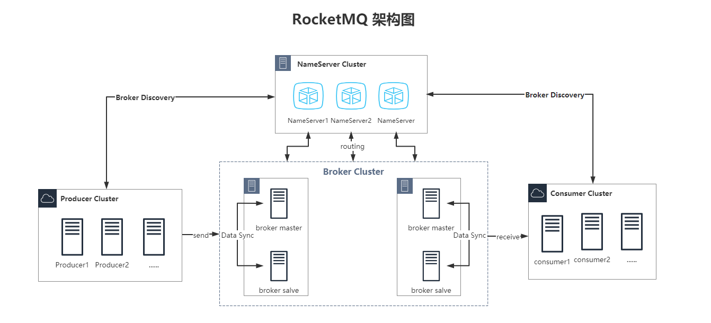

# [Rocketmq搭建文档](../README.md)

- [更新说明](#更新说明)
- [单机环境搭建](#单机环境搭建)
    - [运行环境](##运行环境)
    - [环境准备](##环境准备)
        - [下载上传服务器解压](###下载上传服务器解压)
    - [安装](##安装)
        - [配置环境变量](###配置环境变量)
        - [修改配置文件](###修改配置文件)
        - [修改启动参数](###修改启动参数)
        - [启动](###启动)
        - [快速验证](快速验证)
- [集群环境搭建](#集群环境搭建)
    - [集群架构](##集群架构)
    - [环境准备](##环境准备)
    - [配置集群](##配置集群)
    - [修改启动参数](##修改启动参数)
    - [启动集群](##启动集群)

# 更新说明

| 文档版本|   版本    |  更新说明  |更新时间 | 更新人 |
| ---------|-------|-------|-------|------------ |
| v1.0.0|   **4.7.1**  | 编写rocketmq单机环境搭建文档 | 2020/12/20 | 张子尧 |
| v1.1.0|   **4.7.1**  | 编写rocketmq集群环境搭建文档 | 2020/12/29 | 张子尧 |

# 单机环境搭建

## 运行环境

JDK版本：1.8.0_181
<br>
rocketmq版本：rocketmq-all-4.7.1-bin-release.zip
[官网下载地址](https://archive.apache.org/dist/rocketmq/4.7.1/rocketmq-all-4.7.1-bin-release.zip) | [资源路径](../resources/install/rocketmq/rocketmq-all-4.7.1-bin-release.zip)
<br>
系统：CentOS7.6

## 环境准备

### 下载上传服务器解压

```shell
#解压资源
unzip rocketmq-all-4.7.1-bin-release.zip
```

## 安装

### 配置环境变量

配置jdk环境变量

```shell
#编辑/etc/profile 添加以下内容
vim /etc/profile

export JAVA_HOME=/usr/local/jdk/jdk1.8
export PATH=$JAVA_HOME/bin:$PATH

#刷新profile
source /etc/profile
```

配置rocketmq环境变量

```shell
#编辑/etc/profile 添加以下内容
vim /etc/profile

export CLASSPATH=.:$JAVA_HOME/lib/dt.jar:$JAVA_HOME/lib/tools.jar
export ROCKETMQ_HOME=/usr/local/rocketmq/rocketmq-4.7.1
export PATH=$ROCKETMQ_HOME/bin:$PATH
#注意这里是配置rocket环境变量的地址，多个可以用;隔开
export NAMESRV_ADDR='49.232.166.207:9876'
#刷新profile
source /etc/profile
```

### 修改配置文件

```shell
#进入解压rocketmq的目录找到broker.conf配置文件
vim /usr/local/rocketmq/rocketmq-4.7.1/conf/broker.conf

#broker IP地址
brokerIP1=49.232.166.207
#集群名称
brokerClusterName=beijing01
#broker名称
brokerName=broker01
#master节点 大于0代表都为slave节点
brokerId=0
#nameserver 地址
namesrvAddr=49.232.166.207:9876
#删除文件时间点，默认凌晨4点
deleteWhen=04
#文件保留时间，默认48小时
fileReservedTime=48
#Broker的角色
#-ASYNC_MASTER异步复制Master
#-SYNC_MASTER同步双写Master
#-SLAVE
brokerRole=ASYNC_MASTER
#刷盘方式
#-ASYNC_FLUSH异步刷盘
#-SYNC_FLUSH同步刷盘
flushDiskType=ASYNC_FLUSH
#自动创建主题模式 生产环境不建议开启
autoCreateTopicEnable=true
#存放根路径
storePathRootDir=/data/rocketmq/store
#提交日志存储路径
storePathCommitLog=/data/rocketmq/store/commitlog
```

### 修改启动参数

由于NameServer和Broker默认启动参数所需要的硬件资源比较大，而机器本身内存可能不够造成启动失败，所以建议资源不够的可以调整启动参数内存的小。
<br>
修改runserver.sh

```shell
vim  bin/runserver.sh

##找到JAVA_OPT修改内存大小为 [‐Xms256m ‐Xmx256m ‐Xmn128m]
#具体参数根据预留内存大小进行设置
JAVA_OPT="${JAVA_OPT} ‐server ‐Xms256m ‐Xmx256m ‐Xmn128m ‐XX:MetaspaceSi ze=64m ‐XX:MaxMetaspaceSize=128m"
```

修改runbroker.sh

```shell
vim bin/runbroker.sh

## 找到JAVA_OPT修改内存大小为 [-Xms256m -Xmx256m -Xmn128m]
#具体参数根据预留内存大小进行设置
JAVA_OPT="${JAVA_OPT} -server -Xms256m -Xmx256m -Xmn128m"
```

### 启动

启动namesrv

```shell
#指定ip地址启动
nohup sh bin/mqnamesrv -n 192.168.241.198:9876 &
```

启动broker

```shell
#启动broker
#autoCreateTopicEnable=true 自动创建topic 可以配置文件指定 -c 指定配置文件
nohup sh bin/mqbroker -n 192.168.241.198:9876 autoCreateTopicEnable=true  -c conf/broker.conf &
```

关闭防护墙

```shell
systemctl stop firewalld.service #停止firewall
systemctl disable firewalld.service #禁止firewall开机启动
systemctl status firewalld.service #查看防火墙状态
```

关闭命令

```shell
#正常关闭
sh mqshutdown broker
sh mqshutdown namesrv
#关掉进程
jps
kill -9 进程id
```

### 快速验证

rocketmq官方在安装包中提供了一个tools.sh的工具，可以以命令快速验证rocketmq服务。
<br>
发送消息：默认发送1000条

```shell
bin/tools.sh org.apache.rocketmq.example.quickstart.Producer
```

接受消息

```shell
bin/tools.sh org.apache.rocketmq.example.quickstart.Consumer
```

# 集群环境搭建

## 集群架构

计划搭建三台nameserver，两个broker master，两个broker salve，具体架构图如下：


## 环境准备

```shell
#准备三台虚拟机 并设置免密登录，保证三台机器智联能够正常通信
192.168.201.155 node1
192.168.201.156 node2
192.168.201.158 node3 

#生成key
ssh-kengen

#分发其他机器
ssh-copy-id node1
ssh-copy-id node2
ssh-copy-id node3

#在三台机器上分别配置环境变量 具体参考单机环境搭建中的配置环境变量
```

## 配置集群

计划搭建两主两从异步刷盘集群，官方提供了配置文件，参考conf/2m-2s-async下的配置文件做具体的修改，

```shell
[root@VM-0-8-centos conf]# ll
total 52
drwxrwxrwx 2 root root  4096 Dec  6 12:26 2m-2s-async
drwxrwxrwx 2 root root  4096 Dec  6 12:26 2m-2s-sync
drwxrwxrwx 2 root root  4096 Dec  6 12:26 2m-noslave
-rwxrwxrwx 1 root root   341 Dec 30 09:41 broker.conf
drwxrwxrwx 2 root root  4096 Dec  6 12:26 dledger
```

<br>
在官方提供的配置文件中分为以下几种集群模式：

- 2m-2s-async：两主两从异步刷盘 高吞吐量，但是消息可能会丢失
- 2m-2s-sync：两主两从同步刷盘 吞吐量会下降，但消息会较为安全
- 2m-noslave：两主没有从节点，存在单点故障
- broker.conf：单节点配置
- dledger：主从切换，节点之间会通过raft协议选举出一个leader二其他的节点都为follower

[配置文件参考](../resources/conf/rocketmq)

## 修改启动参数

参考单机配置修改 runserver.sh和runbroker.sh的启动参数

## 启动集群

```shell
 #分别在三台机器上启动nameserver
 nohup bin/mqadminsrv &
 
#在node2上启动一主一从的broker
 nohup ./mqbroker -c ../conf/2m-2s-async/broker-a.properties & 
 nohup ./mqbroker -c ../conf/2m-2s-async/broker-b-s.properties &
 #在node3上启动一主一从的broker
 nohup ./mqbroker -c ../conf/2m-2s-async/broker-b.properties & 
 nohup ./mqbroker -c ../conf/2m-2s-async/broker-a-s.properties &
```

集群环境启动完成